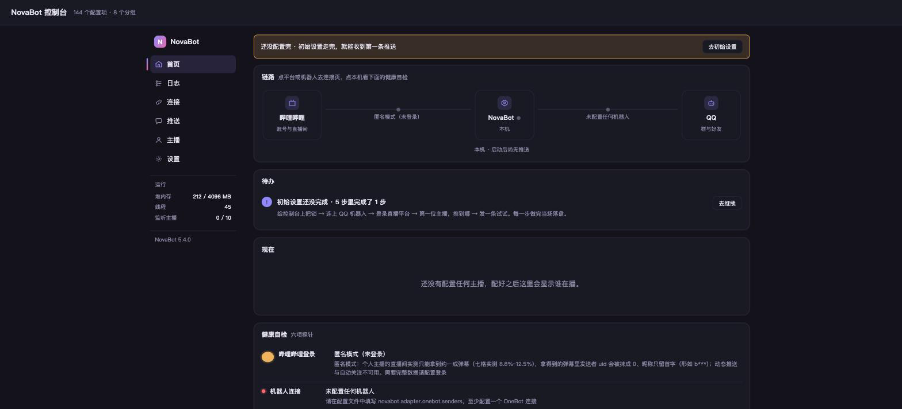
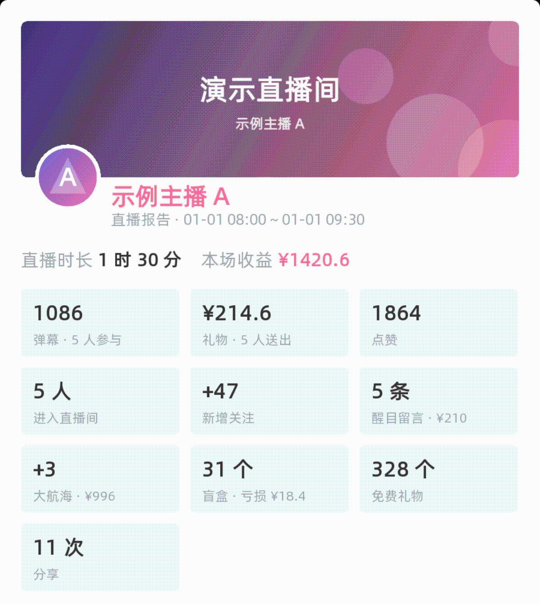

**哔哩哔哩直播与动态推送机器人。** 盯住你关心的 UP 主，开播、下播、发动态时把消息推到 QQ 群或好友；下播后自动生成一张数据报告图；所有配置都在浏览器里完成。

> **NovaBot** watches Bilibili streamers you care about and pushes live-start, live-end and feed updates to QQ groups or friends through an [OneBot](https://onebot.dev/) implementation (e.g. NapCat). It ships with a web console for all configuration and renders a post-stream report image (cover banner, stat cards, interaction curve, leaderboards, danmaku word cloud). Chinese-only UI and docs for now.

```
哔哩哔哩  ──拉取──▶  NovaBot  ──HTTP──▶  OneBot 实现  ──▶  QQ 群 / 好友
（一个账号）        （本程序）        （NapCat 等）
```

<p align="center"></p>
<p align="center"><a href="docs/assets/report-demo.png"></a></p>

## 功能一览

**推送**
- 开播、下播、动态更新三类通知，消息模板在界面里搭积木、右侧实时预览 QQ 里的样子
- 同一位主播可推给多个群或好友，每个目标各配各的模板与开关；静音时段、@全体成员 用量都管得住

**控制台**
- 加主播只要 uid、直播间号或空间链接；勾事件、改模板、发测试消息，每一步当场验证
- 首页看「今日」推送情况，主播页、连接页、日志页、事件时间线各司其职，出问题有健康自检与修复建议
- 配置项由代码生成：新增配置界面自动出现，说明直接取自源码注释，不会「界面和代码对不上」

**报告与数据**
- 下播自动出报告图：封面横幅、数据卡片、互动曲线、五类排行榜、弹幕词云；版式按推送目标分别配置
- 收益是否展示是每个会话自己的属性：默认私聊显示、群聊隐藏，关掉后报告照出、只是不出账本
- 运营趋势按周或月看场次、时长与互动；每一场直播的原始数据整份留存

**群里直接问**
- 11 条聊天命令：查直播间数据、拉排行榜、订阅 `开播@我`、直播中随时拉一份实时报告图
- 命令可按群开关，只有群主、管理员或你配置的超管能动

**安全**
- 控制台与推送接口默认只监听回环并要求访问令牌；外网访问可开口令登录、二次验证与通行密钥
- 登录凭据 AES-256-GCM 加密存储；改配置逐行写入 `application.yml`，注释与顺序保留，自动留带时间戳的备份；配置写坏会进安全模式，仍能在浏览器里改回来

**可扩展**
- 事件输出：把直播间事件实时推给本机其它程序，用于自建面板或独立统计
- 插件机制：弹幕、礼物、上舰等事件可自行监听处理，见[插件开发](#插件开发)
- 告警：登录失效、连接中断、队列积压可推到 QQ 或 Webhook（Bark 一类）

## 你需要准备什么

| 准备 | 说明 |
|---|---|
| 一台长期开机的机器 | Linux / macOS / Windows；**内存 1 GB 以上**，512 MB 不够用 |
| Java 17 或更高 | 一键安装脚本会自动装 |
| 一个 OneBot 实现 | 推荐 [NapCat](https://github.com/NapNeko/NapCatQQ)，由它登录 QQ 并收发消息 |
| 一个哔哩哔哩账号 | **建议用小号**，用于读取动态与完整的直播间事件；原因见[安全说明](SECURITY.md) |

NovaBot 自己不登录 QQ，只把消息交给 OneBot 实现去发。先把 NapCat 跑起来并登录好 QQ，再装 NovaBot。

## 快速开始

Linux 上一条命令完成安装（自动装 JDK 17 与中文字体、构建、创建 systemd 服务）：

```bash
./install.sh
sudo systemctl start novabot && sudo journalctl -u novabot -af
```

日志里有**控制台地址**（含访问令牌）和**登录二维码**。打开控制台，首页的向导会带你完成机器人连接、扫码登录、添加主播、发测试消息。装在远程服务器上时先建隧道：`ssh -L 7827:127.0.0.1:7827 用户名@服务器地址`。

容器部署：

```bash
./build.sh
docker build -f dist/templates/Dockerfile -t novabot:5.4.0 dist/build
docker run -d --name novabot --restart unless-stopped -v novabot-data:/app -p 127.0.0.1:7827:7827 novabot:5.4.0
```

> 默认的 systemd 内存上限按 2 GB 及以上的机器发，1 GB 的机器要连同堆上限一起调低，启动自检会告诉你差多少、改哪里；详见[性能与资源占用](docs/performance.md#该准备多少内存)。

手动安装、首次配置、升级与备份见[用户手册](docs/user-guide.md)。

## 文档

[用户手册](docs/user-guide.md) · [排障与 FAQ](docs/troubleshooting.md) · [架构说明](docs/architecture.md) · [安全说明](SECURITY.md) · [性能实测](docs/performance.md) · [事件源协议](docs/protocol.md) · [本机接一条真实事件流](docs/runbook-local-source.md) · [更新日志](CHANGELOG.md)

## 适用范围与边界

面向**中小型公会、个人势主播及其运营人员**，用于**自有或已获授权**的直播间数据采集、通知与运营分析，典型规模是一到十几个直播间。

**不做风控对抗**：不伪造浏览器指纹、不伪造观看行为、不实现针对平台反自动化机制的对抗手段。大规模采集场景下不保证账号安全与数据完整性，触发平台限流或风控的后果由使用者承担。连接行为按「礼貌客户端」设计：指数退避、全局连接节流、不高频轮询、遵守平台的限流反馈，这是产品的一部分。强烈不建议用于非法或未经授权的大规模数据监控与爬取，完整表述见 [SECURITY.md](SECURITY.md)。

## 资源占用

2 位主播、功能全开、连续运行 63 小时的实测稳态峰值 896 MB，**不是上界**；主播更多、瞬时高峰更猛时还会往上走，那种场景没有测过。默认 systemd 上限 1.2G／1.5G 是「实测峰值＋说得出理由的余量」。方法与数字见[性能实测](docs/performance.md)。

## 构建

需要 JDK 17+ 与 Maven 3.9+：

```bash
./build.sh
```

产物在 `dist/build/`：`NovaBot.jar` 主程序，`lib/` 核心依赖，`plugins/` 与 `plugins-lib/` 插件及其依赖。构建收尾会把产物拷到临时目录、删掉全部配置后真起一次，起不来即构建失败（`--no-smoke` 跳过）。构建先单独安装 `nova-plugin-processor` 再跑 reactor，`build.sh` 已处理；细节见[架构说明](docs/architecture.md#10-构建)。

## 插件开发

复制 [templates/nova-example-plugin](templates/nova-example-plugin) 作为起点，构建前先把本仓构件装进本地 Maven 仓（见[模板 README](templates/nova-example-plugin/README.md#依赖来源)）。用 `@NovaComponent` 注册组件、`@EventListener` 监听事件，实现 `NovaEventHandler` 即可作为推送处理器。插件 jar 放进 `plugins/`，第三方依赖随构建放进 `plugins-lib/`，运行期不联网下载。[可监听的事件类型](docs/architecture.md#可监听的事件类型)列出了全部事件。

## 升级与反馈

- 升级：`install.sh` 或换容器镜像即可，配置与登录态保留；手工升级步骤见[用户手册 §8](docs/user-guide.md#8-升级)
- 问题与建议：请开 [Issue](../../issues)，附上控制台「日志」页或 `journalctl -u novabot` 的相关片段

## 许可证与上游

AGPL-3.0，见 [LICENSE](LICENSE)。本项目基于 LWR 的 StarBot 开发，自 2026-08-03 起独立维护；上游版权声明见 [NOTICE](NOTICE)，改动记录见 [CHANGELOG.md](CHANGELOG.md)。
