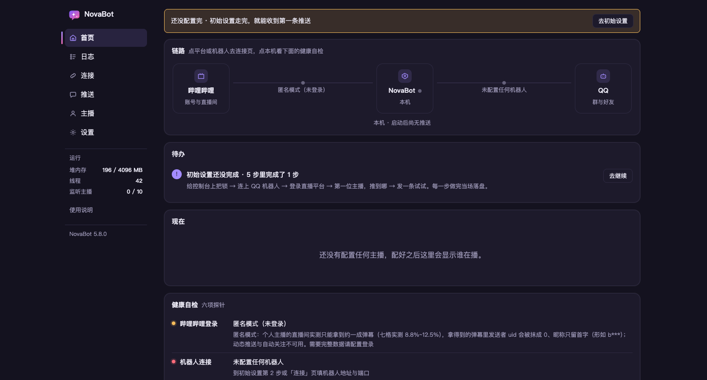
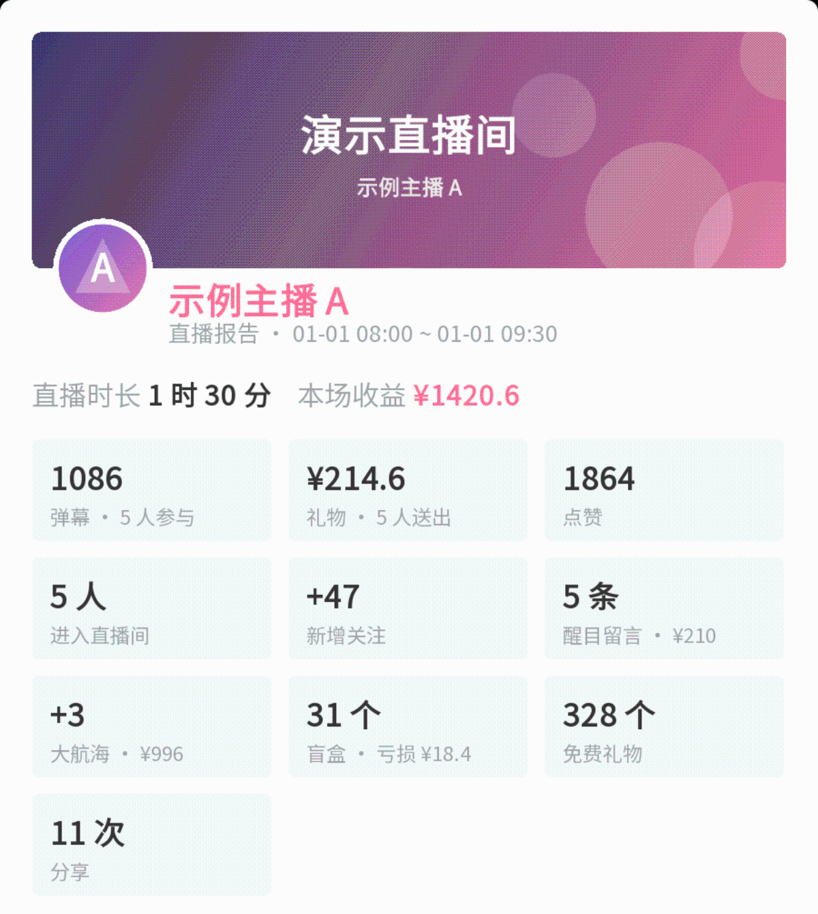

# NovaBot


**哔哩哔哩直播与动态推送机器人。** 盯住你关心的 UP 主，开播、下播或发动态时把消息推到 QQ 群或好友，下播后出一张数据报告图，配置在浏览器里完成。NovaBot watches Bilibili streamers and pushes those updates to QQ through an [OneBot](https://onebot.dev/) implementation such as [NapCat](https://github.com/NapNeko/NapCatQQ). It does not log in to QQ itself.

[](https://github.com/FrostNovaOrg/NovaBot/actions/workflows/ci.yml)
[](LICENSE)
[](https://github.com/FrostNovaOrg/NovaBot/releases)

给中小型公会、个人势主播及其运营人员用，照看自有或已获授权的直播间。它不做风控对抗，也不适合未经授权的大规模采集。适不适合你，先看[第 1 章](https://frostnovaorg.github.io/NovaBot/01-what-novabot-does.html)。手册全文见[用户手册](https://frostnovaorg.github.io/NovaBot/index.html)。

<p align="center"></p>
<p align="center"><a href="docs/assets/report-demo.png"></a></p>

## 功能一览

- **推送。** 开播、下播、动态更新；同一位主播可推给多个群或好友，模板和静音各自配置。
- **控制台。** 加主播、改模板、发测试消息都在浏览器里完成；首页看今天推了什么，出问题有健康自检。
- **报告。** 下播自动出一张数据报告图；群里 @ 机器人也能查数据、拉排行榜、要一张实时图。
- **扩展。** 直播间事件可以推给本机上的其它程序，也可以自己写插件去接弹幕、礼物、上舰。

## 一键安装

先装好 NapCat 并登录 QQ。在 Linux 上克隆本仓库后执行安装脚本：

```bash
git clone https://github.com/FrostNovaOrg/NovaBot
cd NovaBot && ./install.sh
```

手动安装、容器和第一次打开控制台见[第 3 章　安装](https://frostnovaorg.github.io/NovaBot/03-install.html)、[第 4 章　第一次打开控制台](https://frostnovaorg.github.io/NovaBot/04-first-open.html)。升级与备份见[第 13 章　升级与备份](https://frostnovaorg.github.io/NovaBot/13-upgrade-and-backup.html)。机器要准备什么、内存怎么估，见[第 2 章　开始之前要准备什么](https://frostnovaorg.github.io/NovaBot/02-what-to-prepare.html)。

## 详细说明

从[第 1 章　NovaBot 能帮你做什么](https://frostnovaorg.github.io/NovaBot/01-what-novabot-does.html)看起。[用户手册](https://frostnovaorg.github.io/NovaBot/index.html)列出其余章节。遇到问题看[第 14 章　遇到问题怎么办](https://frostnovaorg.github.io/NovaBot/14-troubleshooting.html)。

问题与建议：请开 [Issue](../../issues)，附上控制台「日志」页或 `journalctl -u novabot` 的相关片段。

## 给开发者

构建、开发环境和怎么提交，见[贡献指南](CONTRIBUTING.md)。模块怎么拆、构建时先装哪一块，见[架构说明](docs/architecture.md)。

写插件从 [templates/nova-example-plugin](templates/nova-example-plugin) 复制一份开始，依赖怎么来见[模板说明](templates/nova-example-plugin/README.md)。

本仓库里的开发者文档：[安全说明](SECURITY.md)、[事件源协议](docs/protocol.md)、[性能实测](docs/performance.md)、[本机接一条真实事件流](docs/runbook-local-source.md)、[拿实抓语料回放协议校验](docs/runbook-protocol-corpus.md)、[更新日志](CHANGELOG.md)。

## 许可证

[AGPL-3.0](LICENSE)。本项目基于 LWR 的 StarBot 开发，自 2026-08-03 起独立维护；上游版权声明见 [NOTICE](NOTICE)。
