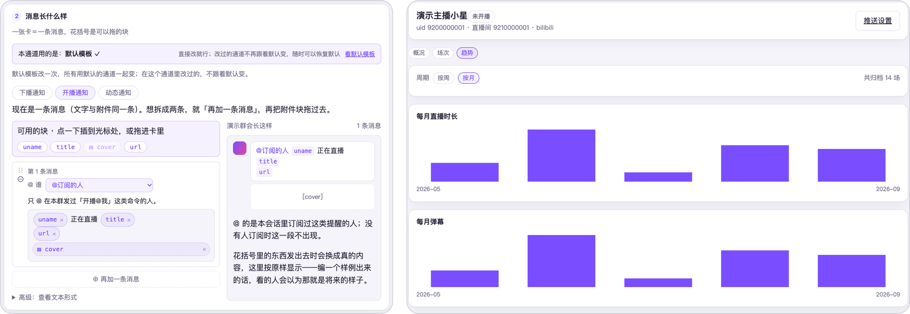

<div align="center">


<h3>哔哩哔哩直播与动态推送机器人</h3>

<p>开播、下播、发动态，第一时间推到 QQ 群和好友；<br>下播自动出一张数据报告图，配置全在浏览器里完成。</p>

<p><sub>Bilibili live &amp; feed notifier for QQ via OneBot, with a web console and post-stream report images.</sub></p>

<p>
<a href="https://github.com/FrostNovaOrg/NovaBot/actions/workflows/ci.yml"></a>
<a href="https://github.com/FrostNovaOrg/NovaBot/releases"></a>
<a href="LICENSE"></a>

</p>

<p>
<a href="https://frostnovaorg.github.io/NovaBot/index.html"><b>用户手册</b></a>
&nbsp;&nbsp;·&nbsp;&nbsp;
<a href="#快速开始">快速开始</a>
&nbsp;&nbsp;·&nbsp;&nbsp;
<a href="CHANGELOG.md">更新日志</a>
&nbsp;&nbsp;·&nbsp;&nbsp;
<a href="templates/nova-example-plugin">插件模板</a>
</p>

<br>

<a href="docs/assets/report-demo.png"></a>

<p><sub>一场直播结束后自动生成的报告图（示例数据，点开看原图）</sub></p>

</div>

## 它能做什么

<table>
<tr>
<td width="50%" valign="top">
<b>推送</b><br>
开播、下播、动态更新三类通知。同一位主播可以推给多个群或好友，消息模板按推送目标各配，静音时段全局设一项，另可按群或好友会话单独设。
</td>
<td width="50%" valign="top">
<b>报告</b><br>
下播自动出一张数据报告图，按周或按月看趋势。群里 @ 机器人也能查数据、拉排行榜、要一张实时图。
</td>
</tr>
<tr>
<td width="50%" valign="top">
<b>控制台</b><br>
加主播、改模板、发测试消息都在浏览器里完成。首页看今天推了什么，出问题有健康自检和修复建议。
</td>
<td width="50%" valign="top">
<b>扩展</b><br>
直播间事件可以推给本机上的其它程序，也可以自己写插件去接弹幕、礼物和上舰。
</td>
</tr>
</table>

<p align="center">

<br>
<sub>控制台里拖块拼消息模板、右侧实时预览；每位主播按周 / 按月看趋势（示例数据）</sub>
</p>

> [!NOTE]
> NovaBot 面向中小型公会、个人势主播及其运营人员，用来照看自有或已获授权的直播间。它不做风控对抗，也不适合未经授权的大规模采集。拿不准是否适合你，先读[第 1 章](https://frostnovaorg.github.io/NovaBot/01-what-novabot-does.html)。

## 快速开始

需要一台能长期开机的机器（Linux、macOS、Windows 都行，内存 1 GB 以上），并已装好 [NapCat](https://github.com/NapNeko/NapCatQQ) 且登录 QQ。NovaBot 经 [OneBot](https://onebot.dev/) 发消息，自己不登录 QQ。

一键安装脚本只支持 Linux。它认得 apt-get、dnf、yum、zypper、pacman、apk 这几种包管理器，缺 Java 17 或中文字体时经它们自动装上；构建用的 Maven（3.9 或更高）要先自己装好。机器上有 systemd 时，脚本顺带建好服务。

```bash
git clone https://github.com/FrostNovaOrg/NovaBot
cd NovaBot && ./install.sh
```

装好后按[第 4 章](https://frostnovaorg.github.io/NovaBot/04-first-open.html)打开控制台，跟着初始设置走完五步，群里就能收到第一条消息。macOS、Windows 用手动安装，另有 Docker 部署，见[第 3 章](https://frostnovaorg.github.io/NovaBot/03-install.html)。

## 文档

| 我想… | 看这里 |
|---|---|
| 判断它适不适合我 | [第 1 章　NovaBot 能帮你做什么](https://frostnovaorg.github.io/NovaBot/01-what-novabot-does.html) |
| 准备机器、估内存 | [第 2 章　开始之前要准备什么](https://frostnovaorg.github.io/NovaBot/02-what-to-prepare.html) |
| 加主播、推到群 | [第 6 章　加主播、推到群](https://frostnovaorg.github.io/NovaBot/06-add-streamer-and-push.html) |
| 看下播报告与趋势 | [第 9 章　看播得怎么样](https://frostnovaorg.github.io/NovaBot/09-stream-reports.html) |
| 升级与备份 | [第 13 章　升级与备份](https://frostnovaorg.github.io/NovaBot/13-upgrade-and-backup.html) |
| 遇到问题 | [第 14 章　遇到问题怎么办](https://frostnovaorg.github.io/NovaBot/14-troubleshooting.html) |

其余章节见[用户手册目录](https://frostnovaorg.github.io/NovaBot/index.html)。问题与建议请开 [Issue](../../issues)，附上控制台「日志」页或 `journalctl -u novabot@<版本>` 的相关片段。

## 参与开发

- **构建与提交**：[贡献指南](CONTRIBUTING.md)
- **模块结构与构建顺序**：[架构说明](docs/architecture.md)
- **写插件**：从 [templates/nova-example-plugin](templates/nova-example-plugin) 复制一份开始，依赖见[模板说明](templates/nova-example-plugin/README.md)
- **更多**：[事件源协议](docs/protocol.md) · [性能实测](docs/performance.md) · [安全说明](SECURITY.md) · [接一条真实事件流](docs/runbook-local-source.md) · [协议语料回放](docs/runbook-protocol-corpus.md)

## 许可证

[AGPL-3.0](LICENSE)。本项目基于 LWR 的 StarBot 开发，自 2026-08-03 起独立维护，上游版权声明见 [NOTICE](NOTICE)。
