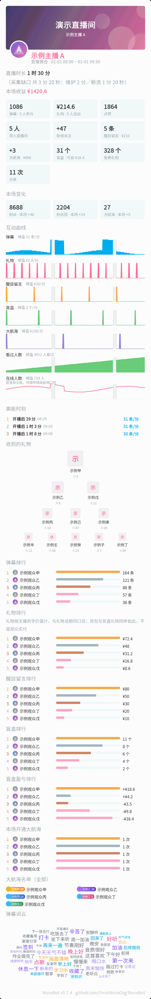

# 第 1 章　NovaBot 能帮你做什么

这一章讲 NovaBot 是干什么的、适合谁用，帮你先判断它是不是你要找的东西。
看完想装，直接翻[第 2 章](02-what-to-prepare.md)。

## 一句话说清楚

NovaBot 是一个哔哩哔哩直播与动态推送机器人。你告诉它要盯哪些 UP 主，它替你守着：

- 开播、下播、发动态时，把消息推到你的 QQ 群或 QQ 好友
- 一场直播结束后，自动生成一张数据报告图：弹幕、礼物、互动都在里面
- 所有配置都在浏览器里完成，不用手改配置文件

消息是经一个 OneBot 实现（比如 NapCat）发出去的，NovaBot 自己不登录 QQ。

## 能帮你做的事

**推消息。** 开播、下播、动态更新三类通知；消息文字在界面里像搭积木一样拼，
右侧实时预览发到 QQ 里长什么样；同一位主播可以推给多个群或好友，
每个目标各配各的模板与开关。

**看数据。** 每场直播自动出一张报告图：封面横幅、数据卡片、互动曲线、排行榜、
弹幕词云、收到的礼物、带粉丝牌的大航海名单。运营趋势按周或月看场次、时长与互动，
每一场的原始数据整份留存。群里 @ 机器人也能随时查数据、拉排行榜、要一张实时报告图。

**省心。** 半夜不想被吵醒可以设静音时段；登录失效、连接中断这类异常能推到 QQ
或手机通知（Bark 一类）；控制台首页随时能看它现在好不好，出了问题有健康自检和修复建议。

> [!TIP] 截图位（待补）：控制台首页整页。露出健康自检与「今日」三个数。
> 页面里出现的主播昵称与头像要用演示数据或打码。

## 适合谁用

给中小型公会、个人势主播和他们的运营人员用，照看**自有或已获授权**的直播间。
典型规模是一到十几个直播间，一台普通的小机器就带得动。

## 不适合拿来做什么

NovaBot **不做风控对抗**：不伪造浏览器指纹、不伪造观看数据、不绕平台的反自动化机制。
这是有意的设计，不是能力不够。所以：

- 大规模采集场景下不保证账号安全，也不保证数据完整，触发平台限流的后果由使用者承担
- 强烈不建议用于非法或未经授权的大规模监控与爬取

想着「挂几百个房间自动薅数据」的话，这不是那个工具。完整的安全说明见
[附录 C](appendix-c-security-and-resources.md)。

想清楚了？下一章说装它之前要准备什么：[第 2 章　开始之前要准备什么](02-what-to-prepare.md)。
