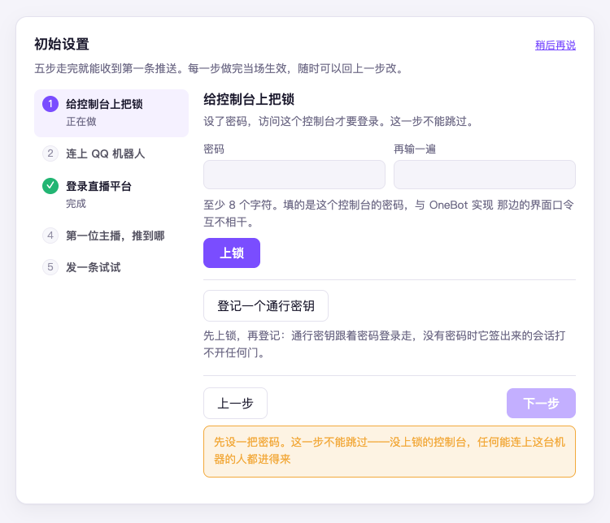
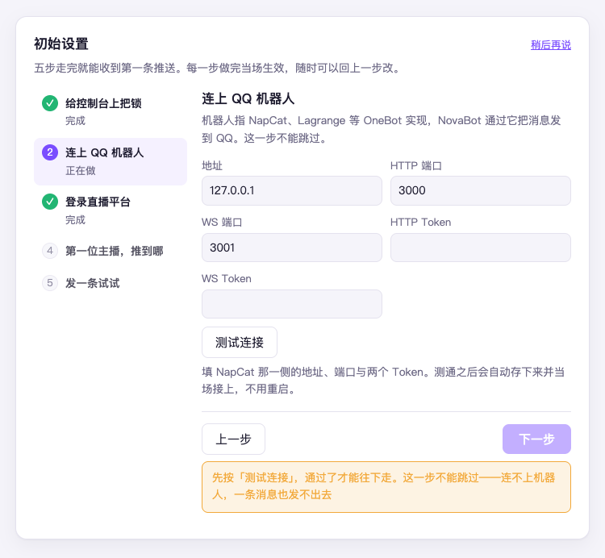

# 第 4 章　第一次打开控制台

程序启动后，日志里有两样东西：

1. **控制台地址**，形如 `http://127.0.0.1:7827/config?token=xxxx`
2. **登录二维码**（终端里直接打出来的字符画）

把第一个抄进浏览器打开。扫码登录的事后面自然会到，先打开控制台。

## 装在别的机器上怎么打开

控制台默认只监听本机。NovaBot 装在远程服务器上时，先在自己的电脑上建一条隧道：

```bash
ssh -L 7827:127.0.0.1:7827 用户名@服务器地址
```

然后在本机浏览器打开同一个地址。不要图省事把端口直接开到公网——控制台能改所有配置。

## 初始设置五步

第一次打开进的是分步引导页，共五步，每一步都会当场验证，做没做成一目了然：

| 步骤 | 做什么 | 怎么算过 |
|---|---|---|
| 1 给控制台上把锁 | 设一把登录密码（至少 8 个字符），可顺手「登记一个通行密钥」 | 密码存下去，这一步变绿（不能跳过） |
| 2 连上 QQ 机器人 | 填机器人那侧的地址、端口与两个 Token，点「测试连接」 | 测通后自动存下并当场接上，回显实现版本与登录的账号（不能跳过） |
| 3 登录直播平台 | 用手机客户端扫二维码；不想登录，点页脚「不登录，先用免登录模式」（见下节） | 扫码后页面自动变为「已登录」并显示账号；选不登录的，这一格打的是警告点，不是勾 |
| 4 第一位主播，推到哪 | 点「找一下」找到主播，选定推给哪个群或好友（可「先不加主播」跳过） | 这台机器上已经有主播了 |
| 5 发一条试试 | 选定收件人发一条真消息 | 群里真的收到 |

五步走完画三行小结：机器人连上没有、直播平台这一头定成了什么、推给谁。
之后想重来，去设置页「登录与安全」组，在「重新跑一遍初始设置」那一行点「重新跑一遍」——已经配好的东西不会被清掉。

**第 5 步不能跳过。** 群号写错、Token 不匹配、机器人不在群里——这几种错误的表现
完全一样：什么都不发生。发一条真消息是唯一能当场分辨的办法。



图里是本机开着匿名模式、免登录跑时的样子，所以左边第 3 步「登录直播平台」已经打了勾
（见下节）；要登录的话，第一次打开时这一步要到扫完码才变绿。



这一张同样是匿名模式下的样子，第 3 步照样已经打勾。地址、端口、Token 照 NapCat 那一侧填，
点「测试连接」测通了才能往下走。

## 不想登录：匿名模式

只要直播弹幕、礼物数据，不需要动态推送、也不想为采集绑一个账号的话，可以免登录跑：
第 3 步页脚那枚「**不登录，先用免登录模式**」会先弹一段后果确认，确认后把向导这一步
放过去——但它只是放了行。要让程序**完全不碰登录**，还得到设置页搜「匿名模式」把它打开、
保存后重启（直接改配置文件的写法见[附录 A](appendix-a-measurements.md)）。打开之后：

- 完全不使用凭据：不弹二维码、不做登录态复检
- 直播采集照常，初始设置的「登录直播平台」一步自动算过，不再催扫码
- 动态推送、自动关注不可用（它们必须有登录态）

但它拿到的数据是不完整的：个人主播的直播间**只拿得到约一成弹幕**，且弹幕里看不出
是谁发的（实测数字与规律收在[附录 A](appendix-a-measurements.md)）。所以匿名模式只适合
本机试跑这类「有多少算多少」的场景，不要拿它做任何依赖「数得准」的事。
要换回登录模式，把匿名关掉、重启、扫码即可。

> [!TIP] 截图位（待补）：五步走完的三行小结页。小结里出现的群名要打码。

## 接下来

到这里整条链路已经通了：主播加了、消息能进群。下一章带你把控制台的每一页认一遍：
[第 5 章　认识控制台](05-console-tour.md)。
