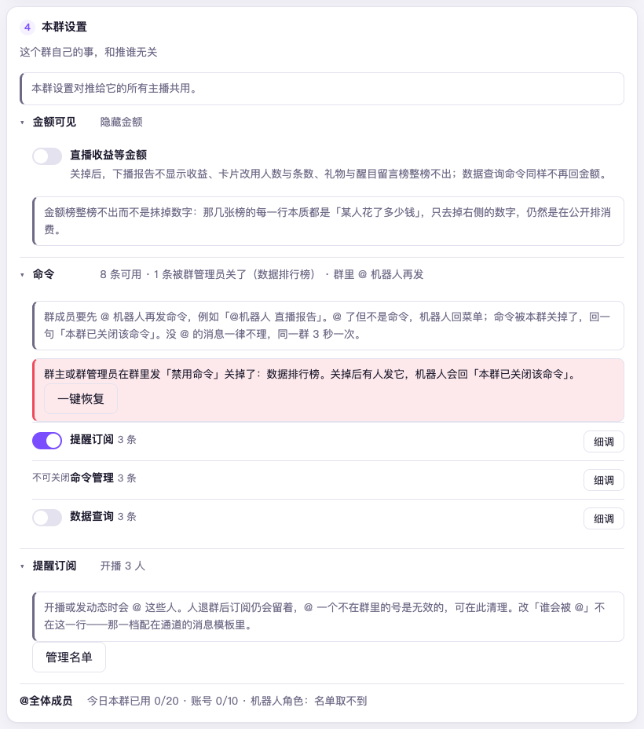

# 第 7 章　管好每个群

消息推到群里之后，群那一头还有几件事要管：金额给谁看、几点别吵、哪些命令开着、谁会被 @。
这些都不是「推谁」的事，是**群自己的事**——所以它们不在主播卡上，而在推送页
通道页的第 4 段「**本群设置**」里：点开一个群的通道，拉到最下面就是。

「本群设置」对推给这个群的**所有主播共用**：这个群下面挂着三位主播时，
在这里改一次，三位一起生效。它默认折成几行摘要，点开哪行改哪行；和页面其它
改动一样，按「保存」才存得下来，按「放弃」全部还原。

## 金额给谁看

「金额可见」这个开关管的是：直播收益这类数字，在这个群显不显示。

它为什么不在报告版式里、而在群设置里？因为金额不只在报告里出现——
「直播间数据」「数据排行榜 礼物」这些命令谁都能在群里打（见[第 8 章](08-commands-in-group.md)），
它们不属于任何推送配置、读不到报告的版式设置。只关报告里的金额，
一句命令就全漏回来了。放在群这一层，报告和命令一起管住。

**默认私聊显示、群聊隐藏。** 在群里关掉（保持默认）之后：

- 流水那张卡只写「付费互动 N 人」，不带钱。醒目留言只写条数，盲盒只写个数，大航海只写次数
- 流水排行、醒目留言名单**整段不出**；盲盒榜照出，只写开了几个；弹幕排行照常
- 「收到的礼物」整段不画；互动曲线照画，流水那条不标峰值
- 「本场开通大航海」名单照出；大航海全名单照常，本场开通或续费过的人名旁仍有「本场」
- 群里查数据的命令同样不回金额。查礼物榜、流水榜、醒目留言、盲盒盈亏会明说
  「本会话不展示金额相关的榜单」，并列出还能查哪些

流水排行和醒目留言名单是整段不出、而不是只抹掉数字：这两处的每一行，本质都是「某人花了多少钱」，
只去掉右侧的数字，仍然是在公开排消费。盲盒榜留下，只写开了几个。

于是常见的用法不需要两套配置：「大群里只放词云和弹幕数，收益自己私聊看」——
同一份报告版式，推给哪个群就按哪个群的可见性画，私聊那边自己就是显示的。

## 静音时段

设置页里的静音时段管的是所有群和好友（见[第 10 章](10-quiet-and-alerts.md)）。
一个号常推好几个群：粉丝群想随时收到开播，工作群夜里不想被吵——这一行就是给这种情况的。
好友的通道里同样有这一行。

它有三档：

- **跟全局**：用设置页那一项。没动过的群和好友都是这一档，和以前一模一样
- **本会话自己的时段**：填开始、结束，格式是 `23:00` 这样的「时:分」，可以跨零点。
  规矩和设置页那一项一样：起止填得一样就算没设。这个群只看自己这一对，不再看全局那一项
- **本会话不静音**：全局在静音时，推往这个群的照发

摘要行写着现在是哪一档、几点到几点；此刻正落在这个群的静音时段里时，后面带「静音中」。
和这一段别的几行一样，按「保存」才存，存完立刻生效，不用重启。

静音的规矩和全局那一项相同：开播、下播、下播报告、动态、下播打赏播报、群里命令的回复，
到了这个群的静音时段一律**直接丢掉，不攒着**，日志页时间线记一条「静音丢弃」。
同一场开播推好几个群时，只丢正在静音的那几个，其余照发。

有三件事不受这一行影响：设置页的「全局推送开关」关着时，哪一档都不发；
告警照常发出；连接页的「发一条试试」照常发。首页顶上的静音提示条只看全局那一项。

## 命令开不开

「命令」这一行摊开后，列出这个群能用的全部命令，按类分组：每组一个总开关，
「细调」进去逐条拨。「菜单」「启用命令」「禁用命令」这三条不可关闭——
关了菜单，群里就再也没办法知道还能用什么；关了启用命令，关掉的东西就开不回来了。

群管理员也可以直接在群里关命令（发「禁用命令 ××」，见[第 8 章](08-commands-in-group.md)）。
他们在群里关掉的，这里会列成一条红字，带一枚「一键恢复」；恢复之后，
群管理员仍然可以再关。改过名、已删除的命令残留下的旧禁用记录也会显示出来，
标明「留着也不会生效」，可以「清掉记录」。

推送页上如果出现一块「配置里已经没有、状态里还留着的会话」，那是曾经配过、
后来从通道里删掉的群或好友。它们不在主播表里，但命令开关还留着——一旦重新配上推送就立刻生效。

## 提醒订阅：谁开播时会被 @

群成员自己发「开播@我」「动态@我」订阅提醒（[第 8 章](08-commands-in-group.md)），
订过的人都记在这里：「提醒订阅」一行显示每个群、每位主播下积了多少人，
点「管理名单」可以移除某一个人，或对某位主播「清空」整份名单——清空在保存前
还会再确认一次，点错了还能撤回。

人退群后订阅仍然留着，@ 一个不在群里的号是无效的，这里正是清理的地方。
注意「谁会被 @」不在这里设——那是在通道的消息模板里 @ 那一档选的
（见[第 6 章](06-add-streamer-and-push.md)）。

## @全体成员

最后一行是状态、不是开关：今日本群已用几次、机器人账号今日已用几次、
机器人在这群里是不是管理员。不是管理员时它会写明：**@全体成员 会被自动摘掉，
正文照发**——「配了 @全体成员 却没 @ 到人」这件事，提前在这里说清了。

## 接下来

群成员自己能做什么？机器人听不懂的怎么问？见[第 8 章　群里怎么用命令](08-commands-in-group.md)。
