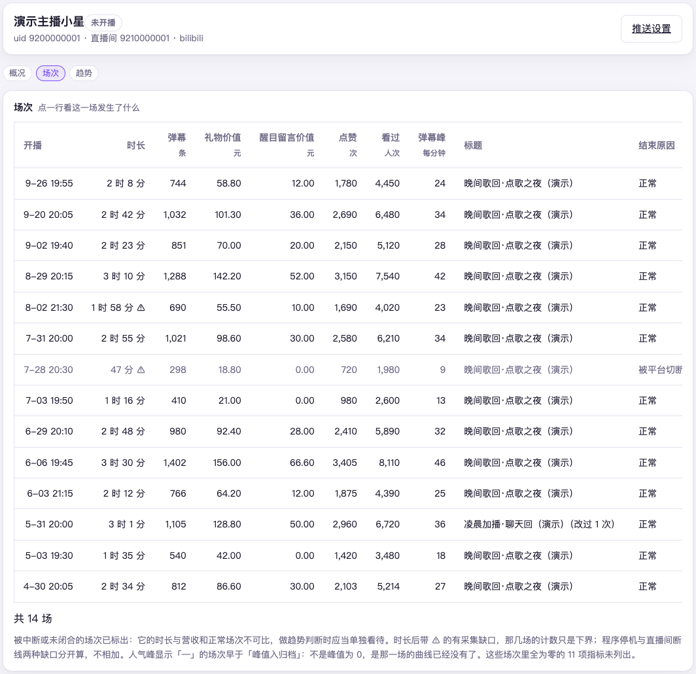
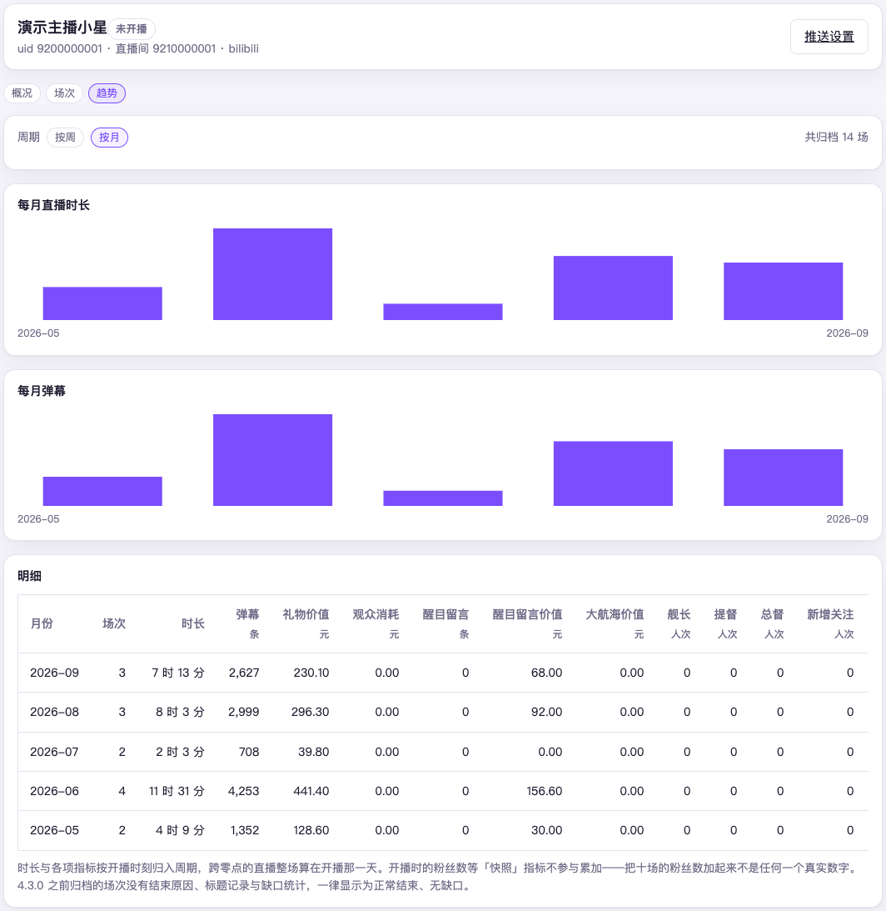
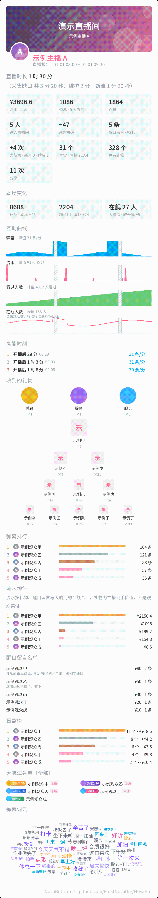

# 第 9 章　看播得怎么样

每场直播结束，NovaBot 会把这一场记下来，并画一张下播报告图。
想回头看某一场、或者看这个月比上个月播得怎么样，去控制台的「主播」页。
想改群里收到的那张报告图长什么样，去「推送」页。

## 在主播页看场次与趋势

打开「主播」页，点一位主播，上面有三个页签：

- **概况**：这位主播的基本情况
- **场次**：每一场一行，点哪一行就看哪一场的报告
- **趋势**：把场次按周或按月聚起来看

这些数字只在控制台里看得到，不会发到群里。

### 场次：一场一行

每行是开播时刻、时长、这一场的各项数字、标题和结束原因。
标题改过的，后面会注明「（改过 N 次）」。主播打开设置又原样保存时，平台也会发一条通知，内容没变的不算一次改动。

点一行就打开「这一场的报告」。报告图每次都按那一场存下的数据当场重画，
所以要稍等一下；早年的场次如果没留下明细数据，会直接告诉你画不出来。

有两种标记要留意：

- **时长后面带 ⚠**：这一场有采集缺口。程序停过（维护、重启）或者直播间连接断过，
  那段时间里的弹幕和礼物没人接收，**事后也补不回来**。鼠标停在时长上能看到缺了多久，
  这一行的每个数字都只是「至少这么多」。
- **结束原因不是「正常」**：可能是「被平台切断」「直播间被封禁」或「异常中断未闭合」，
  这几种行会变灰。「异常中断未闭合」是程序在这一场进行中退出了、没看到结尾，
  结束时刻只能取最后一次存盘的时刻，时长同样只是下界。

这几类场次的时长和收入跟正常场次**不可比**，看趋势时单独看待。

### 趋势：按周、按月

在「趋势」页签选「按周」或「按月」，上面是每周（或每月）的直播时长图，
下面是明细表。读之前先知道这几件事，不然容易把数字读歪：

- **整场算在开播那一天。** 周日深夜开播、周一凌晨下播的那场，整场算在周日那一周，
  不会拆成两半。
- **中间没播的周、月也会列出来。** 空着的那一格本身就说明问题，跳过它会让趋势看着更连贯。
- **加起来的是人次，不是人数。** 每场只存了「多少人」，没存「是谁」。
  同一个人三场都发过弹幕，周合计里算三次。表上不写「人次」两个字，这个数也只能这么读。
- **粉丝数、粉丝团人数、大航海人数不累加。** 它们记的是开播那一刻有多少，
  十场加起来既不是月初也不是月末的数字，所以趋势里不算。
- **在线人数和高能用户也不进周、月。** 每场留下的是那一场的峰值，
  几场峰值加起来既不是同时在线人数，也不是人次。
- **较老版本记下的场次没有缺口统计**，一律显示成无缺口——那是当年没在算，不是真一秒没漏。

## 下播报告长什么样

下播报告是一张长图，从上到下大致是：

1. 直播间封面横幅
2. 一行概况：直播时长。有采集缺口时写在时长后面。这一行不再写赚了多少
3. 数据卡片。第一格是「流水」：礼物（主播到手的价值，含背包礼物和盲盒开出的礼物，不含免费礼物）、醒目留言、大航海加在一起，
   下面写本场付过钱的人数。大航海那张写「+N 次」，分得清时再写「新开 a · 续费 b」。没有单独的礼物卡
4. 本场变化：粉丝、粉丝团涨了多少。大航海写「在舰 X 人」，旁边是「较开播 ±Y」。这是此刻还在舰上的人数，和上面那张「+N 次」不是同一个数
5. 互动曲线：弹幕、流水、看过人数、在线人数，各画一条。礼物、醒目留言、盲盒、大航海不再分开画
6. 高能时刻：弹幕最密集的几个时段
7. 收到的礼物：最上面是总督、提督、舰长，只出本场有人开的档，写次数，一律排在礼物前面。下面是礼物，贵的排前面
8. 排行和名单：弹幕排行；流水排行（每人的礼物、醒目留言、上舰加在一起）；
   醒目留言名单（每人一行：昵称、合计金额、几条，下面带原文）；盲盒榜（每人开了几个、盈亏多少）
9. 大航海全名单。本场开通或续费过的人名旁有「本场」。另一份「本场开通大航海」名单只在不显示金额时出
10. 弹幕词云

哪一块数字为零就不画，冷清的场次报告会自动变短，不留空洞。

图上可能出现两行提示：

- **「采集缺口 共 X 分 X 秒」**，跟在直播时长后面，括号里分列维护、重启、断流各占多少。
  意思同主播页的 ⚠：这一场有一段没收到数据。
- **「有 N 条推送的图片未送达」**：这一场有推送的图片没发出去，但文字发到了。
  为零时不显示，看不到这一行就是都送到了。

互动曲线有四条：弹幕、流水、看过人数、在线人数，各按自己的峰值来画。
没采到数据的那几分钟画成斜纹，不是一条贴着底的面积。
真没人说话的几分钟才是贴着底线的细面积：斜纹是「这段没有数」，细面积是「这段是零」。
不显示金额时，四条照画，流水那条不标峰值。

### 两条人数曲线怎么读

- **看过人数**：这一场累计来过多少人，只涨不跌。它的**斜率**才有信息量——
  哪段时间在涨人，哪段时间没人进来。
- **在线人数**：此刻有多少登录观众在看，会涨也会跌，是哔哩哔哩高能榜那个口径。

两条不是一回事，别拿看过人数当同时在线人数。

### 高能时刻

列出弹幕最密集的几个时段，写的是**距开播多久**，也就是回看录播时要拖到的位置，
方便剪切片。它只挑真高峰：那一分钟要明显高于本场平常的密度、本身也要够热闹，
最多挑三个、彼此隔开几分钟。冷场不会硬凑出三个「高能时刻」，那一段干脆不出现。

它只看弹幕数，不看金额。

## 调报告里放哪些块

报告图的版式**按推送目标分别设**：同一位主播推给两个群，可以一个群给完整版、
另一个群只给简版。

1. 打开「推送」页，找到这位主播和要改的那个群
2. 通道页第 3 段「下播报告长什么样」（「推什么」里开着下播报告才有这一段），左边是开关和数字框，右边是发到群里的样子
3. 默认显示「本通道用的是：默认版式」，点「改为自定义」才能改
4. 改完按页面底部的「保存」

想退回默认，点「恢复默认」。退回之后，默认版式以后再变，这个群也跟着变。

能调的项：

| 项 | 默认 | 说明 |
|---|---|---|
| 直播间封面 | 开 | 顶上的封面横幅 |
| 数据卡片 | 开 | 弹幕、流水、点赞等概览卡片 |
| 本场变化 | 开 | 粉丝、粉丝团与大航海人数的涨幅；每出一张报告要多查三次平台接口，在意请求次数可以关掉 |
| 互动曲线 | 开 | 弹幕、流水等随时间的变化 |
| 本场开通大航海名单 | 开 | 本场开通大航海的观众。只在不显示金额的会话里画；显示金额时不画这张，全名单上的「本场」小标已经标出同一批人 |
| 大航海全名单 | 开 | 这位主播当前的全部大航海，不只本场新开通的。拉不到时会写明，不会让整张报告失败 |
| 全名单人数 | 30 | 展示前几名，0 为不限 |
| 弹幕词云 | 开 | 本场弹幕的词云 |
| 高能时刻 | 开 | 弹幕最密集的几个时段，对应可剪切片的时间点 |
| 礼物列表 | 开 | 本场收到的礼物与大航海，按种类列出个数 |
| 弹幕排行 | 5 | 展示前几名，0 为不展示 |
| 流水排行 | 5 | 每人礼物、醒目留言与上舰的金额合计。展示前几名，0 为不展示 |
| 醒目留言名单 | 10 | 发过醒目留言的观众，每人一行、带原文。展示前几人，0 为不展示 |
| 盲盒榜 | 0 | 每人开了几个、盈亏多少。展示前几名，0 为不展示 |

排行和名单填的都是「展示前几名」，醒目留言名单是前几人，填 0 就不展示。
一个数同时管开关和长度。填得太大或是负数，会被拉回到能画的范围里，不会把图画坏。

### 不想让群里看到金额

版式管的是「图上放什么」，**谁能看到钱**是另一件事，在「推送」页通道的「本群设置」里按群管，
群里默认不显示金额。关掉后报告里哪几块不画、哪几块照画，见[第 7 章](07-manage-groups.md#金额给谁看)；
高能时刻只看弹幕数，不受影响。

### 图上打自己的标

想在图的底部打自己的标，打开设置页搜「标识」：

- **报告自定义标识图片**：下播报告底部。填本机一张图片的路径，留空就不画
- **动态自定义标识图片**：动态那张图的底部，单独一项

两项互不相干。想打同一个标，就填同一个路径。图片按固定高度缩放，画在署名之上。改完要重启。

## 词云不计某些人

直播间里常有欢迎机器人、感谢机器人刷屏，它们的「欢迎」「感谢」会把词云占满。
可以让词云不计这些人的弹幕：

1. 打开设置页，搜「词云」
2. 在「词云不计这些用户」里填对方的**哔哩哔哩用户编号**（个人空间地址里那串数字），每行一个
3. 保存，**立刻生效**，不用重启

要知道的几点：

- **只认编号，不认昵称。** 填昵称或带字母的行会被跳过。
- **只影响词云。** 弹幕排行、弹幕条数照常算这些人。
- **弹幕原文照常保存**，名单删掉后词云就又算回来。
- 在主播页重画以前的场次时，也按现在的名单算词云。
  个别老场次没留下弹幕原文的，词云只能按当时存的样子画，名单对它不起作用。

不想让某些词上词云，就在旁边的「词云不显示这些词」里每行填一个词：凡是包含这个词的词都不出现
（填「哈哈」，「哈哈哈」也不出现），英文不分大小写；保存立刻生效，重画以前的场次也按现在的这张表。

## 接下来

报告能看了，下一件事是别让它半夜吵到人，以及出了事能第一时间知道：
[第 10 章　别被半夜吵醒、出事有人告诉你](10-quiet-and-alerts.md)。
