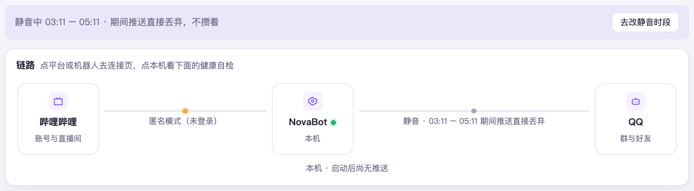
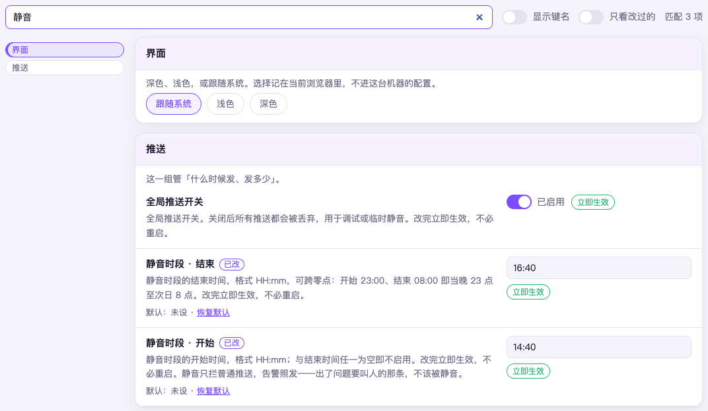
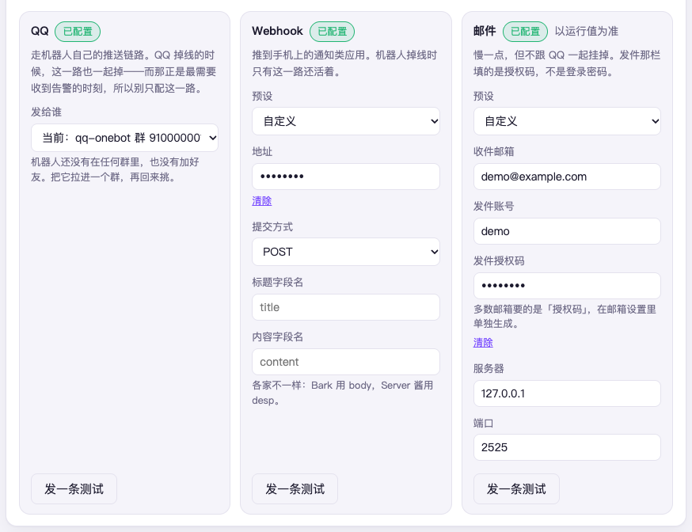

# 第 10 章　别被半夜吵醒、出事有人告诉你

机器人半夜往群里推消息，是这类工具最常见的抱怨；出了故障却没人知道，是第二常见的。
本章讲两件事：怎么让它在该安静的时候安静，以及出事时怎么第一时间通知到你。
最后讲两种「平台那边出了状况」时 NovaBot 会怎么做：@全体成员 次数用完、被平台警告或风控。

## 设静音时段

1. 打开设置页，搜「静音」
2. 填「静音时段 · 开始」和「静音时段 · 结束」，格式是 `23:00` 这样的「时:分」
3. 保存，**立刻生效**，不用重启

可以跨零点：开始 `23:00`、结束 `08:00`，就是当晚 23 点到第二天 8 点。
两项有一项空着、或者两项填得一样，就算没设。

静音期间的推送是**直接丢掉，不攒着**，天亮后不会补发。开播、下播、下播报告、动态，
还有群里命令的回复，一律不发。每丢一次，日志页的时间线上记一条「静音丢弃」。
静音开着时，首页顶上会有一行提示，写着静音的起止时间。

两种测试按钮要分开看：

- 连接页上的「发一条试试」不受静音影响，「全局推送开关」关着时也照样发，它就是用来当场验证机器人通没通的
- 告警组里每一路的「发一条测试」（见下一节）和真告警走同一条路，下面提醒框里的规矩对它一样适用

> [!WARNING] 告警不受静音影响：静音时段里照常发出，半夜出事也会通知你。
> 但「全局推送开关」关着时（首页按下「暂停全部推送」就是把它关掉），走机器人（QQ）的那一路告警不发。点这一路的「发一条测试」，按钮旁当场说没发出去和原因（「QQ 这一路发不出去：全局推送开关已关闭，这条告警没有发出」）；真告警每拦下一条，日志页的时间线上记一条「告警发不出」，写着「QQ发不出去（全局推送开关已关闭，这条告警没有发出）：」后接告警标题。
> Webhook 和邮件两路既不受静音影响，也不受「全局推送开关」影响。

## 出问题时通知我

默认情况下，登录失效、连接中断这类问题**只写日志**。要主动收到通知，打开设置页的「告警」组，
配至少一路告警。一共三路，可以同时开：

| 这一路 | 发到哪 | 要知道的 |
|---|---|---|
| QQ | 你的 QQ 私聊或某个群 | 走机器人自己的发送链路，**机器人掉线时这一路也跟着断** |
| Webhook | 手机上的通知类应用 | 选「预设」里的 Bark、Server 酱、PushDeer 就自动填好；机器人掉线时只有它还活着 |
| 邮件 | 你的邮箱 | 慢一点，但不跟机器人一起挂；「发件授权码」填的是邮箱单独生成的授权码，不是登录密码 |

**别只配机器人那一路。** 最需要知道的故障恰恰是「QQ 掉线了」，而那时候它自己也发不出去。

每一路下面都有「发一条测试」按钮，点一下就真发一条，去手机或邮箱看收到没有。
测试用的是**已经保存**的配置，改完先保存再测。

其他几项：

- **启用告警**：默认开着。关掉后问题只写日志，不再通知。
- **同一问题最短间隔**：默认 1 小时。同一个问题在这段时间里只通知一次，
  故障持续时不会反复刷屏。问题好了会再发一条「状态恢复」。
- **失败重投**（「失败重投 · 间隔」「失败重投 · 最多次数」等几项）：告警本身没发出去时，隔一会儿再投，默认每分钟一次、最多十次。被「全局推送开关」拦下的 QQ 告警不算在内：不重投，开关打开后也不补发。

### 什么情况会告警

首页那几张健康卡（数据存储、推送活动、机器人连接、直播间连接、哔哩哔哩登录、风控与静默降级）
任何一张**从好变坏**时发一条，写明哪一项、出了什么事、建议怎么处理；**从坏变好**时再发一条。
程序大约每分钟看一遍。

另外，主播被平台警告、切流或封禁时也会告警，见本章后面。

### 机器人掉线是怎么发现的

不靠「群里有没有人说话」。有几条互相独立的线索，任何一条发现问题都算：

- 机器人那头会定期发心跳。**心跳停了一段时间**（默认两分钟）就判为连接失效
- 程序**每 5 分钟主动问一次**机器人状态，能发现机器人程序挂了、端口不通、QQ 账号掉线
- 连接**被对方断开**、QQ 账号**被踢下线**时，当场就知道

## @全体成员 次数用完了会怎样

QQ 对 @全体成员 有每日次数限制，**用超了平台不会报错**：消息照发，但那一下 @ 没有效果，
往往过很久才有人发现「怎么没人被 @ 到」。

NovaBot 替你记着账，有两个上限：

- **@全体成员 每日上限 · 账号**：默认 10 次。这个 QQ 号在所有群之间**共用**这 10 次，通常先撞到的是它
- **@全体成员 每日上限 · 单群**：默认 20 次，每个群各算各的

填 0 表示不限。次数按北京时间每天零点清零。

**用完之后，通知照发，只是不 @ 了。** 机器人在这个群里不是群主或管理员时也一样。
日志页时间线上会记一条「未 @ 全体」，写明是哪个原因。具体改成什么样：

- 这条推送的 @ 方式选的是「@全体成员，不行就 @订阅的人」的，改成 @ 订阅了提醒的人
- 机器人接的是 NapCat 的，默认还会把这条消息设成**群待办**，顶在群名片上，
  群里的人照样看得到（设置项「@全体成员 · 用完改发待办」，改了要重启）
- 一条消息去掉 @ 之后什么都不剩，这一条就不发

机器人连不上的那段时间，发不出去的 @全体成员 不占当天的次数。

> [!NOTE] 次数只记在内存里，**程序重启后从零重新记**。当天重启过的话，
> 程序以为还剩的次数可能比 QQ 那边实际剩的多。

## 被平台警告、切流、封禁时会怎样

**会立刻走告警通知你，而不是发到粉丝群里。** 这几件事只有主播本人能处理，
告诉观众除了尴尬没有别的用处。

| 情况 | 告警标题 | 说明 |
|---|---|---|
| 违规警告 | 直播收到违规警告 | 切流前的提醒，及时按提示调整就不会被切 |
| 直播流被切断 | 直播流被平台切断 | 这一场已被平台掐掉 |
| 直播间被封禁 | 直播间被封禁 | 比切流更重，封禁期间开不了播；告警里带解封时间（平台给了的话） |

这些消息来自直播间连接本身，不需要额外去查平台接口，所以风控也挡不住它们。

被切断、被封禁的那一场，在主播页的场次里结束原因会写成「被平台切断」或「直播间被封禁」
（见[第 9 章](09-stream-reports.md)）。只收到警告、最后正常下播的，结束原因照常写「正常」。

## 被平台风控时会怎样

哔哩哔哩对请求太频繁的程序会「风控」：接口不再给数据，而是回一个「拦下了」的答复。
这时候硬着头皮连着再请求，只会被拦得更久。所以 NovaBot 被拦下后会**隔一段再试**：

- 哪个接口被拦，**这个接口先等 1 分钟**，其他接口照常用
- 等待期间，这个接口**一个请求都不发**；到点只放一个请求去试
- 试了还被拦，**等待时间加倍**：2 分钟、4 分钟、8 分钟……**最长等 30 分钟**
- 试通了，冷却解除，照常请求

等待期间，要用到这个接口的操作会直接失败，并告诉你「被风控拦下，约 N 分钟后再试」。

添加主播时资料没补上（只显示编号、没有昵称头像），或者登录后账号昵称没取到的，
**不用重新操作**：冷却结束后程序会自己再查一次。

普通的临时失败（平台服务不可用、超时、网络断了一下）不算风控，不用等冷却，
当场隔几秒再试几次（设置项「B站接口 · 最多重试次数」「B站接口 · 重试间隔」，
默认 3 次、每次隔 3 秒）。

风控是否在发生，看首页「风控与静默降级」那张卡；工程日志里也会有「接口 … 被风控拦下（…），进入冷却」
和「接口 … 已恢复（…），冷却解除」这样的行（怎么看工程日志见[第 11 章](11-where-to-see-what-happened.md)）。

## 接下来

告警配好后，出了事你会收到通知。收到之后去哪看具体发生了什么：
[第 11 章　出了什么事去哪看](11-where-to-see-what-happened.md)。
