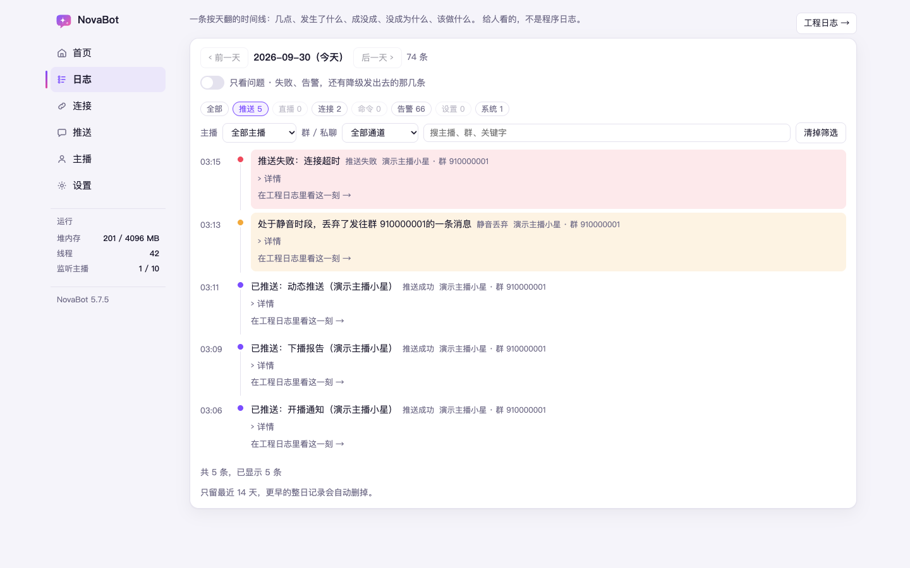
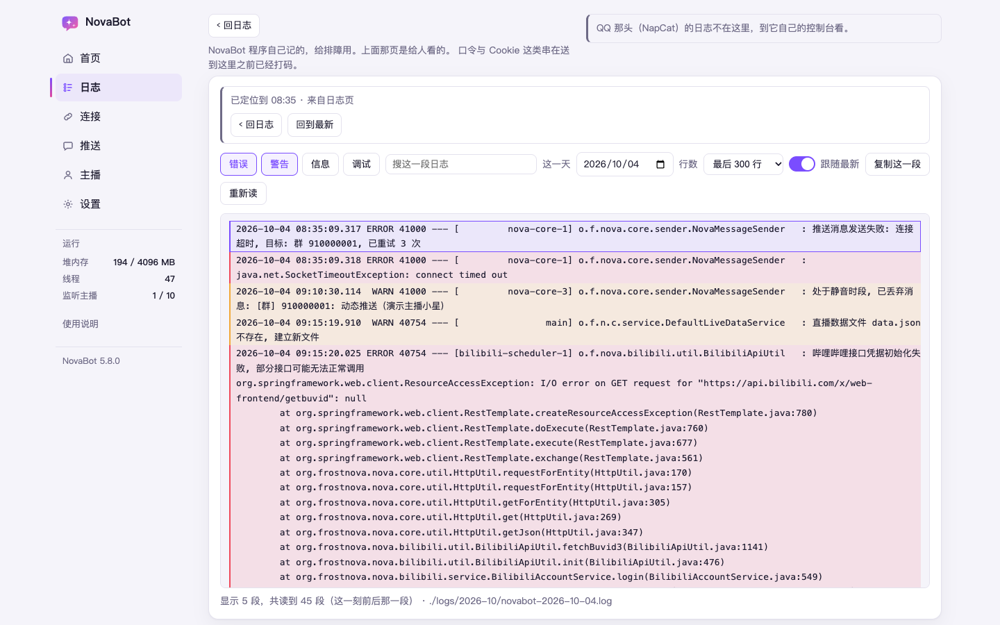

# 第 11 章　出了什么事去哪看

「昨晚那条开播怎么没推？」「刚才那句命令怎么没回？」这类问题，先去控制台的「日志」页。
它是一条按天翻的时间线：几点、发生了什么、成没成、没成为什么。
时间线说不清的，再点进「工程日志」看程序自己记的明细。

## 日志页：一天一页的时间线

打开「日志」页，默认是今天。顶上是「‹ 前一天」「后一天 ›」和日期，
翻页会**直接跳到最近一个有记录的日子**，中间没记录的日子不用一天天点过去。

每一条是一行：时间、一个小圆点（红的是出错、黄的是要留意）、发生了什么、
属于哪一类，再往后是哪位主播、哪个群或好友。点「详情」展开更多，
点「在工程日志里看这一刻 →」直接跳到工程日志的那一分钟。

一次先显示 200 条，页底点「看更早的」再往前翻。

### 时间线上会出现哪些事

| 分类 | 记的是什么 |
|---|---|
| 推送 | 推送成功、推送失败；静音丢弃、暂停丢弃；屏蔽词挡下；未 @ 全体 |
| 直播 | 开播、下播 |
| 连接 | 某一项状态变化（变坏或恢复）、登录失效 |
| 命令 | 命令执行、认不出的命令、冷却忽略 |
| 告警 | 告警发出、告警发不出 |
| 设置 | 设置即时生效、设置待重启 |
| 系统 | 启动、停止、清理旧备份 |

几条常问的：

- **静音丢弃**：在静音时段里，一次推送被丢掉了（见[第 10 章](10-quiet-and-alerts.md)）
- **暂停丢弃**：「全局推送开关」关着，推送被丢掉了
- **屏蔽词挡下**：一条动态命中了设置页「动态屏蔽词」里的某个词，没有推。
  会写明是哪位主播、命中了哪个词。一条动态只记一次，推给几个群都一样
- **未 @ 全体**：@全体成员 次数用完、或机器人不是管理员，这一条没 @ 人（见第 10 章）
- **告警发不出**：告警那一路坏了；没配任何告警通道时也记这一条，提醒你告警其实没人收
- **认不出的命令**：群里有人发了像命令但认不出的话，机器人回了菜单
- **冷却忽略**：同一句命令发得太快，冷却期内这一句没回

### 筛选

- 「只看问题」：只留失败、告警，还有降级发出去的那几条
- 分类按钮：「全部」「推送」「直播」「连接」等，每个按钮上写着这一天有几条
- 「主播」「群 / 私聊」两个下拉框
- 搜索框：搜主播、群、关键字

筛完一条都不剩时，页面会写明**是哪几项筛选挡住的**，每项单独可以点掉，
也可以「全部清掉」。两种常见的空：

- 选了「直播」又筛了某个群：开播、下播记录不属于任何群，这时总是空的
- 选了「告警」但告警是关着的：这里不会有记录

筛选条件会写进地址栏，把地址发给别人，对方打开看到的是同一个筛法。

### 记录留多久

默认留最近 **14 天**（含今天），更早的整天自动删掉。页底写着当前留几天。
要改，去设置页搜「事件时间线保留天数」，填 0 表示一直留着，改完要重启。

时间线只是排障用的线索。每一场直播的数据另外存着，不会跟着删。

## 工程日志：程序自己记的明细

时间线告诉你「那条没推出去，原因是推送失败」，工程日志告诉你「失败时平台回了什么」。
从日志页顶上的「工程日志 →」进去，或者从时间线某一条的「在工程日志里看这一刻 →」进去。

口令、Cookie 这类敏感的串在送到页面之前**已经打码**，显示成一串星号，「复制这一段」复制出来的也是打过码的。

Linux 一键安装的机器上，NovaBot 的输出在 journal（`journalctl -u novabot@版本号`）与这里的日志文件里，
系统日志 `/var/log/syslog` 里默认不再记一份。要的话，安装时加 `--keep-syslog`。

### 怎么找

- **级别**：「错误」「警告」「信息」「调试」四个按钮，点哪个开关哪一档
- **搜这一段日志**：只在已经读进来的那些行里搜，边打边筛
- **这一天**：换日期看别的日子
- **行数**：读最后 300、1000 或 2000 行
- **跟随最新**：开着时每 3 秒看一次有没有新行（只在你停在最底下时跟）
- 「复制这一段」「重新读」

**只看「错误」和「警告」时**，会从当天整份日志里找，不只看最后那一段。
当天日志特别大时可能扫不到头，页底会写「只扫到几点几分，更早的没有扫」。

从时间线跳过来时，顶上写着「已定位到 某时某分」；那一分钟没有记录的话，
会定位到离它最近的一行并说明。点「回到最新」回到末尾。

一条出错的记录下面跟着的一长串调用栈，跟那条记录放在一起显示。特别长的一行只显示开头一段，
行尾写着截去了多少字。

筛完一行都不剩时，同样会写明是哪几项挡住的（级别、搜索、定位），可以单独点掉。

这张截图是在连不上网的演示环境里拍的，最底下才露出那条「哔哩哔哩接口凭据初始化失败」；
正常联网使用时不会出现这条报错。

### 机器人那头的日志不在这里

QQ 机器人程序（比如 NapCat）自己的日志不在 NovaBot 的工程日志里，
要到它自己的界面看。工程日志页上有「打开 NapCat 界面 ↗」的链接。

### 日志文件在哪、留多久

装好的 NovaBot 目录下：

| 目录 | 里面是什么 | 留多久 |
|---|---|---|
| `logs/` | 工程日志，就是这一页读的那份，按月分目录、按天分文件 | 30 天，合计不超过 1GB |
| `NetworkDebug/` | 网络请求记录，排障时才会用到 | 30 天，合计不超过 1GB |
| `EventDebug/` | 直播间事件记录，含观众昵称和编号 | 7 天，合计不超过 128MB |

过期的自动删掉。这几项在控制台里改不了。更早版本留在这三个目录里、「年-月」文件夹下、文件名以 `starbot-`、`starbot-event-`、`starbot-network-` 开头的旧日志，按同样的天数清理；挪到别的目录的不会动。删空的月份目录会一并去掉。

要把日志文件发给别人帮忙看时，**先自己过一遍**：工程日志页那道打码是显示时才做的，
文件不经过它；观众昵称、编号、群号这些本来也不在打码之列。

## 接下来

下一章讲设置页本身怎么用：[第 12 章　设置页怎么用](12-settings.md)。
